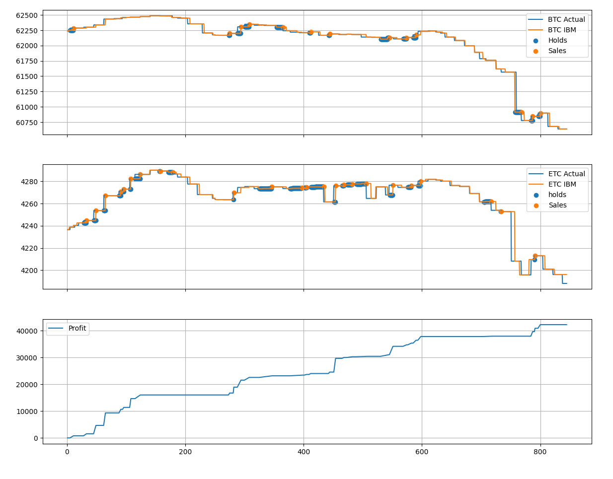

# CryptoBrawl - bot

> Powered by coingecko ← kazali tu dać to daje xD.

Bot <marquee>Bank Busters</marquee>, który został stwożony na konkurs [CryptoBrawl](https://cryptobrawl.pl/) zorganizowanego przez firmę IBM.

Bot został napisany przez:
- Grzegorz Koperwas
- Kamil Kowalczyk

Bot tak profesjonalny że miał wykresy w czasie rzeczywistym:



# Opis:

Zostało stwożonych parę algorytmów do zarabiania, zwanych dalej planami:
- Plan A - Wykożystywanie błędów w zaokrąglaniu
- Plan B - Implementacja HFT, posiadał oprócz orginalnej wersji dwie inne odmiany:
    - Plan B² - Wersja działająca od połowy rundy finałowej, zawierająca algorytm wybierający inteligentnie pomiędzy BTC oraz ETH.
    - Plan B³ - (niezaimplementowany) - proponowane dodanie możliwości zmiany inwestycji w locie, na tą która przyniesie większe zyski.
- Plan C - Głęboka modyfikacja planu B, nigdy nie użyta poza testami
- Plan D - Połączenie planów B oraz C, porzucony na rzecz B², niezaimplementowany.
- Plan Z - Ręczne handlowanie w oparciu o parę zasad.


Jak by co, to za *tick* rozumie się czas między odświerzeniami kursu na platformie, początek ticku jest zaraz po odświerzeniu kursu, początek
zaraz przed odświerzeniem.

## Plan A:

Implementacje znajdziesz na branchu `RoundingScript`.

Algorytm analizował co tick błędy zaokrąglania liczb na platformie, dlatego dzieci nie robimy między innymi obliczeń finansowych na 
floatach. Jeżeli platforma zaokrąglała akurat w górę to program automatycznie kupował i natychmiast sprzedawał którąś z kryptowalut. 
Czynił tak aż do osiągnięcia jakiegoś celu, potem szedł spać. (tacy sneaky byliśmy)

Niestety jako iż jedna z drużyn odkryła ten sam błąd, ale robiła jakieś 300 tranzakcji na minutę, to platforma ,,Z przyczyn technicznych"
została zamknięta, błąd naprawiony i start konkursu opóźniony o 12 godzin.

## Plan B:

Implementacja jest na masterze.

Algorytm składał się z dwóch części:

- Część sprzedająca, uruchamiana na początku ticku.
- Część kupująca uruchamiana na końcu ticku.

Głównym celem algorytmu była próba *wyprzedzenia* kursu na platformie, gdzie kożystając z innego źródła dannych niż te zapewnione przez organizatora,
próbował przewidywać kurs na platformie. Takie upośledzone HFT, tylko zamiast ryć tunel pod światłowód krótszy o 5m by zarabiać 20zł na zmianie kursu 
sajgonek między różnymi giełdami, nasz skrypt robił to podczas ticku, czyli miał jakieś 15 lub 60 sekund na swoje zagrania.

Źródłem dannych było darmowe API coingecko, kurs z pewnego powodu **bardzo** przypominał ten z platformy (sus).

### Kupowanie:

Jeśli cena kryptowaluty była wyższa na coingecko, bot kupował ją za wszystko co miał.

### Sprzedawanie:

Jeżeli cena kryptowaluty na platformie była niższa lub równa coingecko, albo cena na coingecko była niższa od ceny kupna, to bot sprzedawał wszystko co miał.

Tak, to były jakieś 4 ify.

## Plan C (nieuruchomiony):

Implementacja na branchu `plan_c`.

Algorytm kożystał z API Coinbase.com zamiast coingecko, miało ono inny kurs, ale wyższą częstotliwość odświerzania dannych. Z tego powodu
nie zarabiał on na każdej małej górce, ale na dużych dołkach i robił on inwestycje bardziej długoterminowe.


### Kupowanie:

```python
if coinbase > ibm:
    all_in()
```

### Sprzedawanie:

```python
if coinbase < ibm:
    all_out()
```

## Plan D:

Proponowane połączenie plany B oraz C, które nie omijało by chwilowych dołków, nawet wtedy kiedy plan B nie posiadał przewagi w danych. Porzucone
ponieważ plan B² był wystarczający.

Ogólnie to kupowanie z `or` w if'ie.

## Plan Z:

1. Otwórz platformę w jednej karcie
2. Otwórz jakiś wykres w czasie rzeczywistym w drugiej.
3. Jeśli linia iść w góra, to kali kupować. Jeśli iść w dół to kali sprzedawać.

Kamil zarobił dość duże kwoty podczas pierwszej rundy w poniedziałek robiąc to na boku w robocie.

